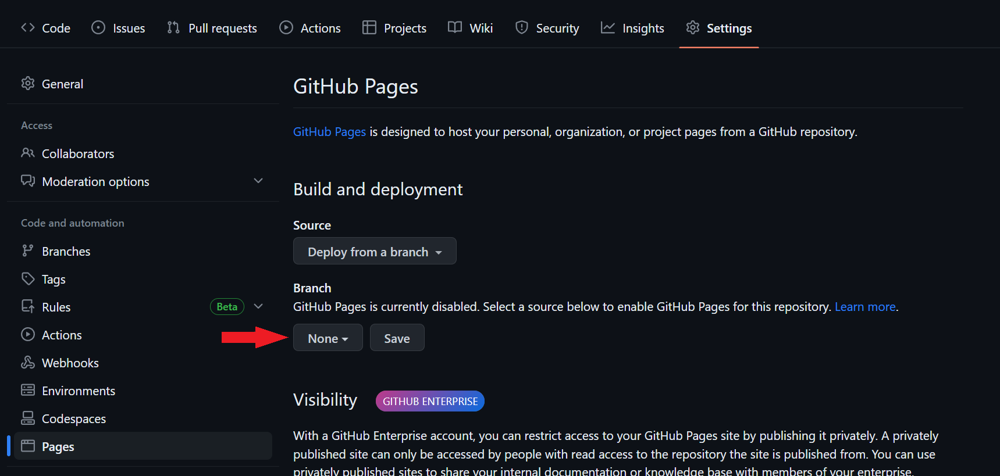

Blazor is a web development framework created by Microsoft that allows you to build interactive web applications using C# and .NET. The main feature of Blazor is its ability to run C# code in the browser using WebAssembly.

GitHub Pages is a service offered by GitHub that allows you to host static websites directly from a GitHub repository. It is an excellent option for those who want to publish simple web pages without the need to set up a separate web server.

Now the question is how we can host our blazor application directly from GitHub?. It's easy. We simply need a github account and in this case a Blazor WebAssembly project and a simple workflow.

First, we create a repository or rename an existing one to `<user>.github.io`. Once we have the new name and our project uploaded, we can start creating the action.

Then we go to ["Actions"](https://docs.github.com/en/actions) tab in the repository and create our own file .yml.


To this action we introduced the following settings:
```yaml
name: 'Blazor to Github Pages' # Name of the action

# Run workflow on every push to the master branch
on:
  push:
    branches: [ main ] # Branches in which the action will operate 

jobs:
  deploy-to-github-pages:
    runs-on: ubuntu-latest
    steps:
    - uses: actions/checkout@v2 # uses GitHub's checkout action to checkout code form the branch
    
    # Sets up .NET Core SDK 6
    - name: Setup .NET Core SDK
      uses: actions/setup-dotnet@v1
      with:
        dotnet-version: '6.0.x'

    # publishes Blazor project to the release-folder
    - name: Publish .NET Core Project
      run: dotnet publish MyBlog.csproj -c Release -o release --nologo
   
    # Add .nojekyll file to tell GitHub pages to not treat this as a Jekyll project. (Allow files and folders starting with an underscore)
    - name: Add .nojekyll file
      run: touch release/wwwroot/.nojekyll
      

    - name: Deploy to GitHub Pages
      uses: JamesIves/github-pages-deploy-action@v4.4.1
      with:
        token: ${{ secrets.TOKEN }}
        BRANCH: gh-pages # Branch where is going to be publish
        FOLDER: release/wwwroot # Folder where the release come from 

```

There are different projects to carry out this action but in this case we have used the project from [James Ives](https://github.com/JamesIves/github-pages-deploy-action). For this task to work it needs permissions, so we need a key [here you have all the related information](https://docs.github.com/en/actions/security-guides/encrypted-secrets) when the key is created we have to add it in the project configuration as a repository secret.

Once we have the action working, we need to activate the service to host the project in "Settings" tab -> "Pages". 

Using "Deploy from a branch," select the branch where the action publishes the files. In this case, it is the branch gh-pages. Click save, and it's done.