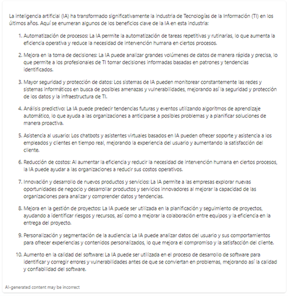

Surely many of us have had the opportunity to interact with an artificial intelligence tool, but do we know how it works and what is the best way to interact with it? In this article we will give you the most relevant guidelines to improve the clarity of the answers obtained, as well as their accuracy, efficiency and compatibility with the limitations of the different AI models.

We must keep in mind that OpenAI is an independent company that develops and offers artificial intelligence services, such as the GPT-4 model. OpenAI sets its own terms and conditions for the use of its models and services. OpenAI users pay directly to the company for the use of its services, which are generally based on token consumption and access level. In addition, OpenAI stores the information provided in prompts and can make use of it for other purposes.

Unlike OpenAI, with Azure OpenAI you do not pay by using the data supplied, so it is essential to consider how queries affect the service. Currently, Azure OpenAI operates under a consumption model, where users pay per token used. Each model has a specific cost for both queries and answers generated. For example, the GPT-3.5-Turbo has a price of 0.0014€ per 1000 tokens sent to the service and a cost of 0.0019€ per 1000 response tokens generated by the model.

If you want to know more about the approximate prices per token for each model you can see it on the official Microsoft website.

 

## What are tokens?
 

Artificial intelligence models do not use natural language directly, words are translated into tokens by a means called tokenization. This technique refers to the process of converting a word or phrase into smaller units to facilitate natural language analysis and processing. Tokens are the individual units into which a text can be broken down for analysis or processing. In natural language processing, tokenizing is the process of breaking text into meaningful pieces, which can be words, numbers, symbols, depending on the approach used.

In OpenAI's official website, they provide an example of how words are converted into tokens and they provide us with a tool with which we can see how our words are converted into tokens. You can explore more about this process by visiting the following link: https://platform.openai.com/tokenizer.

For example, using the page mentioned above, when tokenizing the word "Intelequia", it is split into 3 ["Int", "ele", "quia"] and this is translated into tokens [1090, 10274, 84722]. The ability to manage tokens varies by model. For example, in the "GPT-4-32k" model, it could handle up to 32,000 tokens. This implies that such a model would have the ability to process and parse texts with a maximum of 32,000 tokens.

 

## Why is it important to control the number of tokens?
 

To understand why it is important we need to know how it works. First of all, in a chat we have 3 main elements: the context, the question and the answer.

Normally in a chat to remember the topic and the thread that is being discussed we have a context and this in turn is divided into 3 parts. These parts are: the system message, the question history and the last question. Normally the chat has a system message that is responsible for giving the initial guidelines of how the style of the answer should be, then contains all the history of previous questions and answers, and finally contains the last question that we have asked and we are looking for an answer. It should be noted that as the conversation progresses, older messages may no longer be included in the context.

Depending on the type and size of our project, we may be interested to a greater or lesser extent in controlling the use of tokens in more detail, both by limiting the response and by controlling the questions. When they are very recurrent and similar questions, when automating a process, at the time of writing a system message, we might be interested in controlling how many tokens we are using per question and thus be able to delimit their use.

**Let's see an example:**

We have these two questions, one of them uses 41 tokens while the other uses only 15:

**Prompt with more tokens:** "Please provide a detailed summary of the main benefits and advantages offered by the implementation of artificial intelligence in the IT industry."

**Prompt with fewer tokens:** "List benefits of artificial intelligence in the IT industry."

Can you guess which prompt prompted this response?

Indeed, it was the short prompt of 15 tokens.

 

## Tips to reduce the use of tokens in questions
Let's give some tips on how to control the use of tokens to reduce the use of tokens in questions:

 

- Use short and concise sentences: Avoid using unnecessary or redundant words. Get to the point and ask direct questions.
- Use keywords: Identify the most important words you need to include in your question to make it clear and precise.
- Avoid unnecessary details: Do not include information that is not relevant to the question you are asking.
- Use abbreviations or acronyms: If there are long terms or names that can be abbreviated, do so to save tokens.
- Divide the question: Avoid asking questions that contain several sub-questions.Instead, ask individual questions for each topic.
- Review and edit: Before submitting your question, check if there is a way to make it shorter without losing meaning.
- Break up the question: If possible, break your question into several shorter parts and ask them separately.
- Eliminate filler words: Do not use words such as "please", "thank you", "hello" or "good morning", which do not provide relevant information to the question.
 

In conclusion, we can say that reducing the number of tokens in the prompts is the best practice for several reasons:

 

- Clarity and accuracy: by simplifying and shortening a question, it is easier for the AI to understand and process the information, leading to more accurate and relevant answers.
- Efficiency: AI models process and analyze text in units called tokens. Fewer tokens mean less computational resources and time required to process the question, resulting in a faster response.
- Model limitations: Some AI models have restrictions on the number of tokens they can handle in a single query. Reducing the number of tokens avoids exceeding these limits and ensures that the query is processed properly.